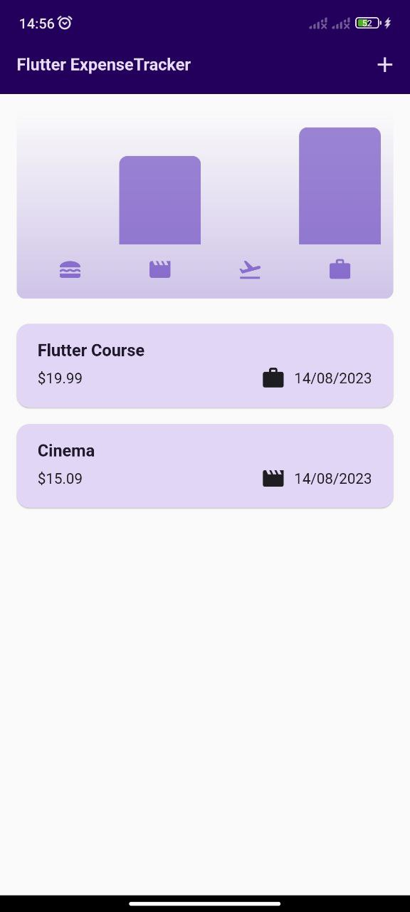
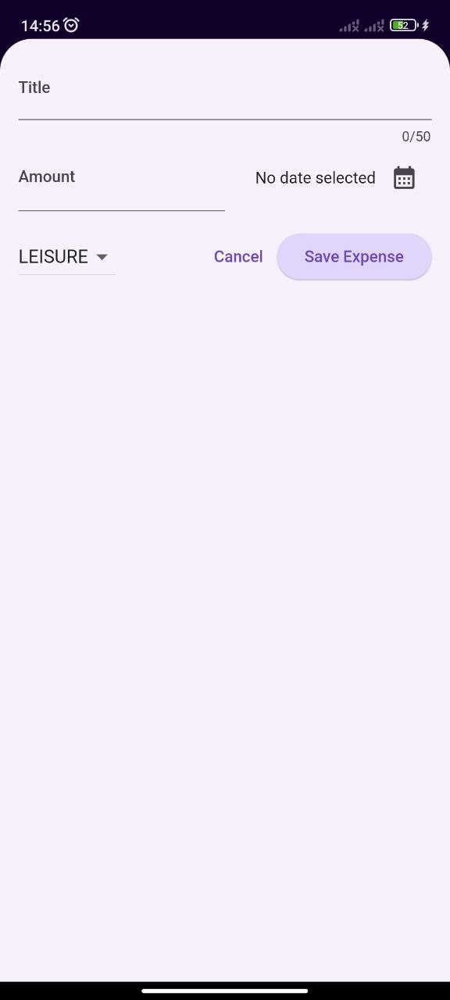
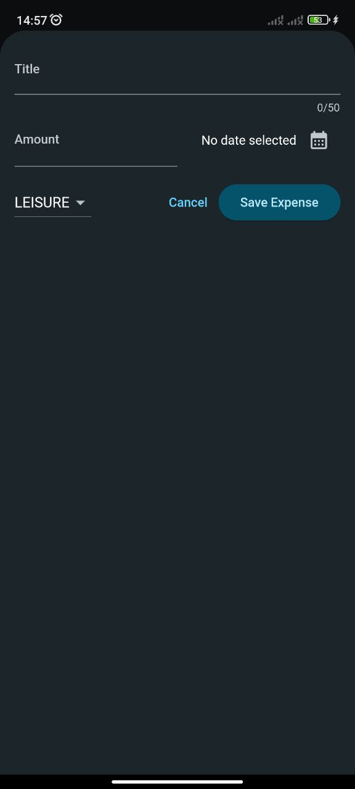

# Expense Tracker

The Flutter expense tracker is a user-friendly mobile application designed to efficiently monitor and manage personal finances through intuitive interfaces and real-time expense logging.

## Screenshots
- Main Page(light) 

- Main Page(dark) 

- Add new expense(light) 

- Add new expense(dark) 

## Getting Started

This project is a starting point for a Flutter application.

A few resources to get you started if this is your first Flutter project:

- [Lab: Write your first Flutter app](https://docs.flutter.dev/get-started/codelab)
- [Cookbook: Useful Flutter samples](https://docs.flutter.dev/cookbook)

For help getting started with Flutter development, view the
[online documentation](https://docs.flutter.dev/), which offers tutorials,
samples, guidance on mobile development, and a full API reference.
